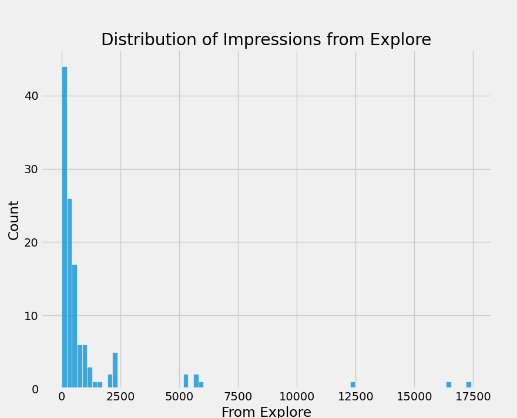

**Instagram Reach Analysis using Python**
==================================================

**We analyze the reach of Instagram posts and make a predictions with insights gained**
-------------------------------------------------------------------------------------
We worked on Instagram posts by Aman Kharwal, a data specialist who shared his own data, through this analysis we can understand how Instagram's algorithm works and with meaningful insights we conclude with a prediction.

### EDA Process
Then cleaning data we analyzed impressions from different sources:

Distribution of impressions received from home

Distribution of impressions received from hashtags

Distribution of impressions received from explore

Impressions On Instragram From Various Sources

A wordcloud of the caption column to look at the most used words in the caption of the Instagram posts

A wordcloud of the hashtags column to look at the most used hashtags in the Instagram posts

Now let's look at the relationships between the different insights

Let’s have a look at the relationship between the number of likes and the number of impressions on the Instagram posts

Let’s see the relationship between the number of comments and the number of impressions on the Instagram posts

Let’s have a look at the relationship between the number of shares and the number of impressions

Let’s have a look at the relationship between the number of saves and the number of impressions

There is a linear relationship between the number of times the post is saved and the reach of the Instagram post. 
At the end let’s have a look at the correlation of all the columns with the Impressions column, conversation rate and a prediction of the reach of an Instagram post by giving inputs to the machine learning model: Features Likes, Saves, Comments, Shares, 
Profile Visits and Follows:

### Usage
This is how we can analyze and predict the reach of Instagram posts with machine learning using Python. 
If a content creator wants to do well on Instagram in a long run, they have to look at the data of their Instagram reach. 
That is where the use of Data Science in social media comes in.

**Author**
------------
* Renar Zamora - renarzamora@gmail.com

**Tools**
----------------
* Python 3.11, Visual Studio Code, scikit-learn, Seaborn, Matplotlib, WordCloud, Pandas, Numpy
